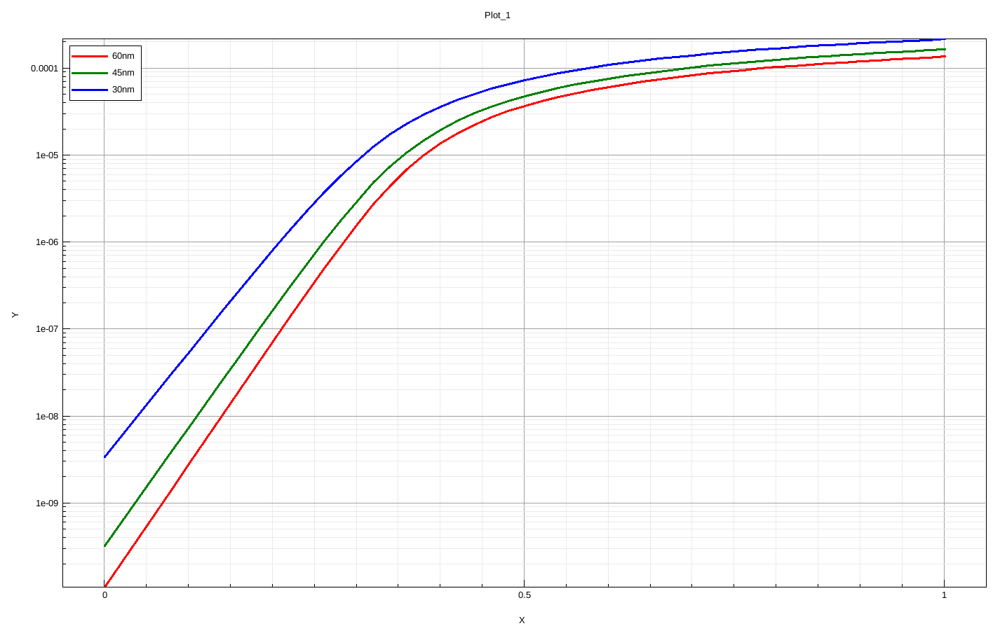

# tcad-short-channel-effects-planar-nmos
TCAD-based study of short-channel effects in planar NMOS, focusing on threshold voltage roll-off and DIBL.

# TCAD-Based Analysis of Short-Channel Effects in Planar NMOS

This repository contains an independent TCAD-based study of short-channel effects in a planar NMOS transistor using Synopsys Sentaurus.

## Objective
To analyze threshold voltage roll-off and drain-induced barrier lowering (DIBL) by scaling the gate length across 60 nm, 45 nm, and 30 nm.

## Methodology
- Planar NMOS device constructed using Sentaurus SDE
- Electrical simulations performed using Sentaurus SDevice
- Id–Vg characteristics simulated at:
  - Low drain bias (Vds = 0.05 V)
  - High drain bias (Vds = 1.0 V)
- Threshold voltage extracted using the constant-current method (Id = 1e-7 A)

## Results

### Id–Vg Characteristics (Vds = 0.05 V)

### Id–Vg Characteristics (Vds = 1.0 V)

## Key Observations
- Threshold voltage decreases with gate length scaling due to reduced gate electrostatic control.
- DIBL increases significantly as gate length is reduced:
  - 60 nm: ~38.6 mV/V
  - 45 nm: ~59.8 mV/V
  - 30 nm: ~107.1 mV/V
- Results demonstrate drain electric field penetration into the channel at short gate lengths.

## Tools Used
- Synopsys Sentaurus (SDE, SDevice, SVisual)

## Notes
This project was carried out as an independent learning exercise to understand device electrostatics and short-channel behavior in planar MOSFETs.
